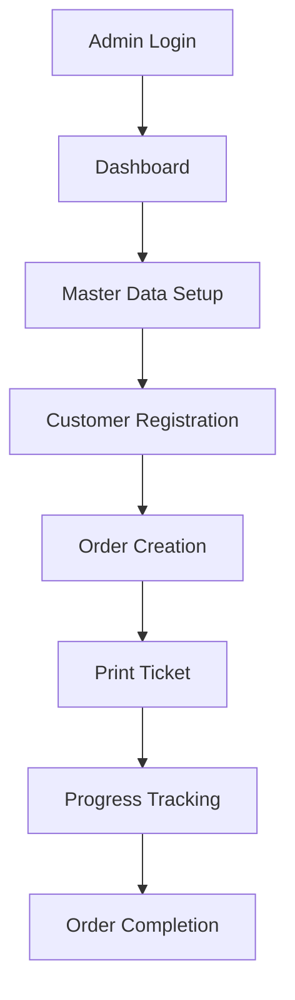

# 🧵 Aplikasi Tiket Jahit

**Full-Stack Web Application untuk Manajemen Order Pakaian (Ukur, Potong, Jahit)**

[](https://kit.svelte.dev/)
[](https://www.typescriptlang.org/)
[](https://tailwindcss.com/)
[](https://turso.tech/)

> 🎯 **Tujuan**: Digitalisasi proses manajemen order jahit dengan sistem cetak tiket, tracking progress, dan database online yang dapat diakses dari mana saja.

## 📋 Table of Contents

- [🚀 Quick Start](#-quick-start)
- [✨ Features](#-features)
- [🏗️ Architecture](#️-architecture)
- [📁 Project Structure](#-project-structure)
- [🛠️ Development Guide](#️-development-guide)
- [🔧 Configuration](#-configuration)
- [📊 Database Schema](#-database-schema)
- [🎨 UI Components](#-ui-components)
- [📱 API Documentation](#-api-documentation)
- [🧪 Testing](#-testing)
- [🚀 Deployment](#-deployment)
- [📚 Documentation Links](#-documentation-links)
- [🤝 Contributing](#-contributing)

## 🚀 Quick Start

### Prerequisites

- **Node.js**: v18+ dengan pnpm
- **Turso Account**: Untuk database cloud
- **Git**: Untuk version control

### Installation

```bash
# 1. Clone repository
git clone <repository-url>
cd tiket-jahit

# 2. Install dependencies
pnpm install

# 3. Setup environment variables
cp .env.example .env
# Edit .env dengan konfigurasi Anda

# 4. Setup database
pnpm db:push
pnpm db:seed

# 5. Start development server
pnpm dev
```

### First Run

1. Buka http://localhost:5173
2. Login dengan credentials default:
   - **Username**: `admin`
   - **Password**: `admin123` (sesuai .env)
3. Mulai setup master data (measurement labels & templates)

## ✨ Features

### 🔐 Authentication & Authorization
- Secure login system dengan Auth.js
- Session management
- Protected routes
- Password change functionality

### 👥 Customer Management
- Customer registration (Individual & Institution)
- Customer search & filtering
- Order history per customer
- Contact information management

### 📏 Measurement System
- **Measurement Labels**: Define measurement types (Lingkar Dada, Panjang Lengan, dll)
- **Measurement Templates**: Grouping labels (Baju, Celana, Seragam)
- Drag & drop template builder
- Template cloning functionality

### 📝 Order Management
- **Multi-template orders**: Satu order bisa multiple templates
- Dynamic measurement forms
- Order status tracking: `new` → `printed` → `in_progress` → `done`
- Progress tracking untuk tukang (ukur, potong, jahit)
- Advanced search & filtering

### 🖨️ Print System
- **Configurable print layouts**: A4, A5, Thermal sizes
- **QR Code/Barcode generation**: User-configurable content
- Print-optimized CSS
- Auto status update saat print
- Print preview (optional)

### ⚙️ Settings Management
- **Custom Order Number Format Builder**: Drag & drop format components
- Print configuration
- QR code content templates
- User preferences

### 📊 Dashboard
- Order statistics & metrics
- Recent orders overview
- Quick action buttons
- Visual progress indicators

## 🏗️ Architecture

### Tech Stack

| Layer | Technology | Purpose |
|-------|------------|---------|
| **Frontend** | SvelteKit + Svelte 5 | Reactive UI & SSR |
| **Backend** | SvelteKit API Routes | Server-side logic |
| **Database** | Turso (libSQL) | Distributed SQLite |
| **ORM** | Drizzle ORM | Type-safe database queries |
| **Auth** | Auth.js | Authentication & sessions |
| **UI** | TailwindCSS + daisyUI | Styling & components |
| **Forms** | Superforms + Zod | Form handling & validation |
| **Deployment** | Vercel | Edge deployment |

### Application Flow



## 📁 Project Structure

```
src/
├── lib/
│   ├── components/
│   │   ├── ui/              # UI components (e.g., from daisyUI)
│   │   ├── forms/           # Form components
│   │   ├── layout/          # Layout components
│   │   └── print/           # Print-specific components
│   ├── server/
│   │   ├── db/
│   │   │   ├── schema.ts    # Database schema
│   │   │   ├── migrations/  # Migration files
│   │   │   └── seed.ts      # Seed data
│   │   └── auth.ts          # Authentication config
│   ├── stores/              # Svelte stores
│   ├── utils/               # Utility functions
│   ├── types/               # TypeScript types
│   └── schemas/             # Zod validation schemas
├── routes/
│   ├── (protected)/         # Protected routes
│   │   ├── dashboard/       # Dashboard pages
│   │   ├── customers/       # Customer management
│   │   ├── orders/          # Order management
│   │   ├── measurements/    # Labels & templates
│   │   ├── settings/        # Configuration
│   │   └── print/           # Print layouts
│   ├── auth/                # Authentication pages
│   └── api/                 # API endpoints
├── app.html                 # HTML template
└── hooks.server.ts          # SvelteKit hooks
```

## 🛠️ Development Guide

### Available Scripts

```bash
# Development
pnpm dev                 # Start dev server
pnpm build              # Build for production
pnpm preview            # Preview production build

# Database
pnpm db:push            # Push schema to database
pnpm db:studio          # Open Drizzle Studio
pnpm db:seed            # Seed database dengan sample data
pnpm db:migrate         # Run migrations

# Code Quality
pnpm lint               # Run ESLint
pnpm format             # Format code dengan Prettier
pnpm check              # Run svelte-check

# Testing
pnpm test               # Run unit tests
pnpm test:e2e           # Run E2E tests
pnpm test:watch         # Run tests dalam watch mode
```

### Development Workflow

1. **Feature Branch**: Create branch dari `main`
   ```bash
   git checkout -b feature/nama-fitur
   ```

2. **Development**: Implement feature dengan tests
   ```bash
   pnpm dev  # Start development
   # Write code & tests
   pnpm test # Verify tests pass
   ```

3. **Quality Check**: Ensure code quality
   ```bash
   pnpm lint    # Check linting
   pnpm check   # Type checking
   pnpm format  # Format code
   ```

4. **Pull Request**: Create PR untuk review

### Code Style Guide

- **TypeScript**: Strict mode enabled
- **Naming Conventions**:
  - Files: `kebab-case.svelte`, `PascalCase.ts`
  - Variables: `camelCase`
  - Constants: `UPPER_SNAKE_CASE`
  - Database: `snake_case`
- **Import Order**:
  1. Node modules
  2. `$lib` imports
  3. Relative imports

## 🔧 Configuration

### Environment Variables

```bash
# Database (Required)
DATABASE_URL="libsql://your-database-url"
DATABASE_AUTH_TOKEN="your-auth-token"

# Authentication (Required)
AUTH_SECRET="your-32-character-secret-key"

# Initial Admin (Required untuk seed)
INITIAL_ADMIN_USERNAME="admin"
INITIAL_ADMIN_PASSWORD="secure-password"

# Optional
NODE_ENV="development"
ORIGIN="http://localhost:5173"
```

### Database Setup

```bash
# 1. Install Turso CLI
curl -sSfL https://get.tur.so/install.sh | bash

# 2. Login to Turso
turso auth login

# 3. Create database
turso db create tiket-jahit

# 4. Get connection info
turso db show tiket-jahit
turso db tokens create tiket-jahit

# 5. Update .env file dengan credentials
```

### Settings Configuration

Aplikasi menggunakan database-driven configuration yang dapat diubah via UI:

| Setting Key | Description | Default Value |
|-------------|-------------|---------------|
| `order_number_format` | Format order number | `ORD-{YYYY}{MM}{DD}-{XXX}` |
| `tracking_code_content` | QR code content | `{tracking_code}` |
| `print_paper_size` | Default paper size | `A4` |
| `show_print_preview` | Show print preview | `true` |

## 📊 Database Schema

### Core Entities

```sql
-- Customer management
customer (id, name, type, institution_name, phone, address, created_at)

-- Measurement system
measurement_label (id, name, default_unit, is_active, created_at)
measurement_template (id, name, description, is_active, created_at)
measurement_template_label (id, template_id, label_id, order_index, is_required)

-- Order management
order (id, customer_id, order_number, tracking_code, notes, status, created_at, printed_at, completed_at)
order_template (id, order_id, template_id, display_order, notes)
measurement (id, order_template_id, label_id, value, unit)

-- System
user (id, username, password_hash, name, role, is_active, created_at, last_login)
settings (id, key, value, description, category, data_type, updated_at)
```

### Relationships

- `customer` 1:N `order`
- `order` N:M `measurement_template` (via `order_template`)
- `measurement_template` N:M `measurement_label` (via `measurement_template_label`)
- `order_template` 1:N `measurement`

### Indexes

```sql
-- Performance indexes
CREATE INDEX customer_name_idx ON customer(name);
CREATE INDEX order_status_idx ON order(status);
CREATE INDEX order_created_idx ON order(created_at);
CREATE INDEX order_number_idx ON order(order_number);
```

## 🎨 UI Components

### daisyUI Components

Komponen UI diadopsi dari [daisyUI](https://daisyui.com/components/), sebuah koleksi komponen gratis berbasis Tailwind CSS. Komponen-komponen ini bersifat copy-paste dan dapat langsung digunakan atau dimodifikasi sesuai kebutuhan.

### Custom Components

| Component | Path | Purpose |
|-----------|------|---------|
| `DataTable` | `$lib/components/ui/DataTable.svelte` | Reusable data table dengan sort/filter |
| `FormDialog` | `$lib/components/ui/FormDialog.svelte` | Modal form wrapper |
| `StatusBadge` | `$lib/components/ui/StatusBadge.svelte` | Status indicator |
| `SearchInput` | `$lib/components/ui/SearchInput.svelte` | Debounced search input |
| `PrintLayout` | `$lib/components/print/PrintLayout.svelte` | Print-optimized layout |

### Usage Examples

```svelte
<!-- Data Table -->
<DataTable
  data={customers}
  columns={customerColumns}
  searchable={true}
  sortable={true}
/>

<!-- Form Dialog -->
<FormDialog
  title="Add Customer"
  {form}
  on:submit={handleSubmit}
  on:cancel={handleCancel}
/>

<!-- Status Badge -->
<StatusBadge status="in_progress" />
```

## 📱 API Documentation

### Authentication

```typescript
// Login
POST /auth/signin
Body: { username: string, password: string }

// Logout
POST /auth/signout
```

### REST Endpoints

```typescript
// Customers
GET    /api/customers              // List customers
POST   /api/customers              // Create customer
GET    /api/customers/[id]         // Get customer
PUT    /api/customers/[id]         // Update customer
DELETE /api/customers/[id]         // Delete customer

// Orders
GET    /api/orders                 // List orders (with filters)
POST   /api/orders                 // Create order
GET    /api/orders/[id]            // Get order details
PUT    /api/orders/[id]            // Update order
PUT    /api/orders/[id]/status     // Update status
PUT    /api/orders/[id]/progress   // Update progress

// Templates
GET    /api/templates              // List templates
POST   /api/templates              // Create template
POST   /api/templates/[id]/clone   // Clone template

// Settings
GET    /api/settings               // Get all settings
PUT    /api/settings               // Update settings
```

### Query Parameters

```typescript
// Orders endpoint filters
GET /api/orders?status=new&customer=john&page=1&limit=10

// Search functionality
GET /api/customers?search=john&type=individual
```

## 🧪 Testing

### Test Structure

```
tests/
├── unit/                    # Unit tests
│   ├── components/         # Component tests
│   ├── utils/             # Utility function tests
│   └── schemas/           # Validation tests
├── integration/            # Integration tests
│   ├── auth/              # Authentication flow
│   ├── crud/              # CRUD operations
│   └── api/               # API endpoint tests
└── e2e/                   # End-to-end tests
    ├── order-flow/        # Complete order workflow
    ├── print/             # Print functionality
    └── admin/             # Admin operations
```

### Running Tests

```bash
# Unit tests (Vitest)
pnpm test                  # Run all tests
pnpm test:watch           # Watch mode
pnpm test:coverage        # Coverage report

# E2E tests (Playwright)
pnpm test:e2e             # Run E2E tests
pnpm test:e2e --headed    # Run dengan browser visible
pnpm test:e2e --debug     # Debug mode
```

### Writing Tests

```typescript
// Component test example
import { render, screen } from '@testing-library/svelte';
import StatusBadge from '$lib/components/ui/StatusBadge.svelte';

test('renders status badge correctly', () => {
  render(StatusBadge, { props: { status: 'new' } });
  expect(screen.getByText('New')).toBeInTheDocument();
});

// E2E test example
test('complete order creation flow', async ({ page }) => {
  await page.goto('/orders/new');
  await page.fill('[name="customer"]', 'John Doe');
  await page.click('[data-testid="submit"]');
  await expect(page).toHaveURL('/orders');
});
```

## 🚀 Deployment

### Production Environment

```bash
# 1. Setup production database
turso db create tiket-jahit-prod
turso db tokens create tiket-jahit-prod

# 2. Configure Vercel
pnpm install -D @vercel/adapter-vercel

# 3. Build & deploy
pnpm build
vercel --prod
```

### Environment Variables (Vercel)

Set these variables di Vercel Dashboard:

```bash
DATABASE_URL="libsql://production-url"
DATABASE_AUTH_TOKEN="production-token"
AUTH_SECRET="production-secret-32-chars"
INITIAL_ADMIN_USERNAME="admin"
INITIAL_ADMIN_PASSWORD="production-secure-password"
```

### Post-Deployment Checklist

- [ ] Database migration completed
- [ ] Seed data inserted
- [ ] Admin account accessible
- [ ] Print functionality working
- [ ] SSL certificate active
- [ ] Performance monitoring setup

### Monitoring & Maintenance

```bash
# Health check endpoints
GET /api/health              # Application health
GET /api/health/db          # Database connectivity

# Backup procedures (if needed)
turso db dump tiket-jahit-prod > backup.sql
```

## 📚 Documentation Links

### Development Resources

- **[High Level Roadmap](./docs/high-level-roadmap.md)**: Project overview & business goals
- **[Detailed Todo List](./docs/detailed-todo-checklist.md)**: Day-by-day development tasks
- **[API Reference](./docs/api.md)**: Complete API documentation
- **[Database Guide](./docs/database.md)**: Schema & migration guide
- **[Component Library](./docs/components.md)**: UI component documentation

### External Documentation

- [SvelteKit Docs](https://kit.svelte.dev/docs) - Framework documentation
- [Drizzle ORM](https://orm.drizzle.team/) - Database ORM
- [Turso Docs](https://docs.turso.tech/) - Database provider
- [daisyUI](https://daisyui.com/components/) - UI components
- [Auth.js](https://authjs.dev/) - Authentication

### Tutorials & Guides

- [First Time Setup](./docs/setup-guide.md)
- [Creating Your First Order](./docs/user-guide.md)
- [Customizing Print Templates](./docs/print-guide.md)
- [Troubleshooting Guide](./docs/troubleshooting.md)

## 🤝 Contributing

### Development Process

1. **Fork & Clone**: Fork repository dan clone locally
2. **Branch**: Create feature branch dari `main`
3. **Develop**: Implement feature dengan tests
4. **Test**: Ensure all tests pass
5. **PR**: Submit pull request dengan deskripsi lengkap

### Code Contribution Guidelines

- **Issues**: Create issue sebelum major changes
- **Commits**: Use conventional commit messages
- **Tests**: Add tests untuk new features
- **Documentation**: Update documentation jika needed

### Commit Message Format

```
type(scope): description

feat(orders): add multi-template support
fix(print): resolve QR code generation issue
docs(readme): update installation guide
test(auth): add login flow tests
```

### Bug Reports

Saat melaporkan bug, include:

- **Environment**: OS, browser, Node version
- **Steps**: Langkah reproduce bug
- **Expected**: Expected behavior
- **Actual**: Actual behavior
- **Screenshots**: Jika applicable

---

## 📞 Support

### Getting Help

- **Documentation**: Check docs folder untuk guides
- **Issues**: Create GitHub issue untuk bugs/features
- **Discussions**: Use GitHub Discussions untuk questions

### Project Status

- ✅ **Version**: 1.0.0
- ✅ **Status**: Production Ready
- ✅ **Last Updated**: 2025
- ✅ **Maintainer**: [Your Name/Team]

---

**Happy Coding! 🚀**

*Built with ❤️ using SvelteKit, TailwindCSS, and modern web technologies.*
